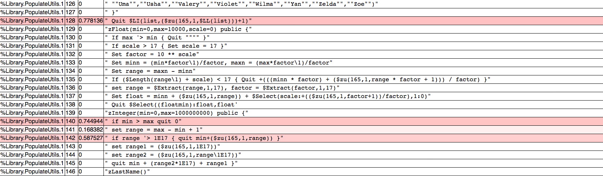

Visualizing the data jungle -- Part II. Excursion

Code coverage and [performance optimization](https://community.intersystems.com/post/importance-benchmarking-your-code) of code has come up a bunch of times already, so most of you should already be aware of the [^%SYS.MONLBL](http://docs.intersystems.com/latest/csp/docbook/DocBook.UI.Page.cls?KEY=GCM_monlbl) utility. 
Often a visual approach to looking at code is much more intuitive than pure numbers, which is pretty much the whole point of this article series. This time we will take a slight excursion away from python and its tools and are going to explore generating heatmaps from  ^%SYS.MONLBL reports.

As a quick reminder a heatmap is just a specific visualization tool, which gives us an overview of data where colors represent a certain value. In our case the data is going to be lines of code, with the time being spent in them mapped to colors.

## ^%SYS.MONLBL

For details about running the line-by-line monitor, check out the [documentation](http://docs.intersystems.com/latest/csp/docbook/DocBook.UI.Page.cls?KEY=GCM_monlbl). In short, are going to work with the full output of an analysis as CSV file. It is a lot more useful if we actually have the sourcecode to the code we are trying to analyse. Be sure to compile your code with the *k* flag (keep source).

## Prepare the output

As targe output we are going to use a prepared html file. This will just include the very basic layout and a little javascript function to do the final coloring.

~~~
<!doctype html>
<html class="no-js" lang="">
    <head>
        <meta charset="utf-8">
        <meta http-equiv="x-ua-compatible" content="ie=edge">
        <title></title>
        <meta name="description" content="">
        <meta name="viewport" content="width=device-width, initial-scale=1">
        
        <!-- Place favicon.ico and apple-touch-icon.png in the root directory -->
        <link rel="apple-touch-icon" href="apple-touch-icon.png">

        <link rel="stylesheet" href="https://cdnjs.cloudflare.com/ajax/libs/normalize/4.2.0/normalize.min.css">
        
        <!--<link rel="stylesheet" href="css/main.css"> -->
            

    
    </head>

    <body onload="colorize()">
        <!--[if lt IE 8]>
            
You are using an <strong>outdated</strong> browser. Please <a href="http://browsehappy.com/">upgrade your browser</a> to improve your experience.

        <![endif]-->

        
        

<table id="data">
<tr><th>Routine</th><th>Line</th><th>Total Time</th><th>Code</th></tr>
<!--output-->
</table>

    </body>
</html>
~~~

## Parsing and putting it together

Getting the relevant information out of the generated CSV and putting it into our template is being done by the following scripts:

*monlbl.sh*
~~~
#!/bin/bash

cat $1|grep -vi totals| awk -F"," 'FNR>1 {out="<tr><td>"$1"</td>" "<td>" $2 "</td><td>" $54 "</td><td><pre>"; for(i=55;i<=NF;i++){out=out$i","}; out=substr(out, 1, length(out)-1) "</pre></td></tr>"; print out }'
~~~

*gen-heatmap.sh*
~~~
#!/bin/bash
./monlbl.sh $1 > /tmp/temp.data
sed -e '/<!--output-->/r/tmp/temp.data' template.html
~~~

Which we call like this:

~~~
./gen-heatmap.sh /tmp/report.csv > heatmap.html
~~~

The final output 

## Adjustables
If you take a closer look at the colouring function in our template, you'll see I'm not using a linear mapping for the times:
~~~
    function colorize() {
        var rows=$("#data tr")
        var max=Math.max.apply(Math,rows.slice(1,rows.length).map(function(){ return this.childNodes[2].textContent}))
        for (i=1;i<rows.length;i++){
            var val=rows[i].childNodes[2].textContent;
            var c=(Math.pow(1-val/max,3))*255;
            var col=rgba(255,c,c,0.7);
            console.log(col);
            rows[i].style.backgroundColor=col;
        }
    }
~~~

I found this to work fairly well with the examples I tested, but your mileage may vary. Obviously you can increase the exponent to push it more into the red, or vice versa. 
